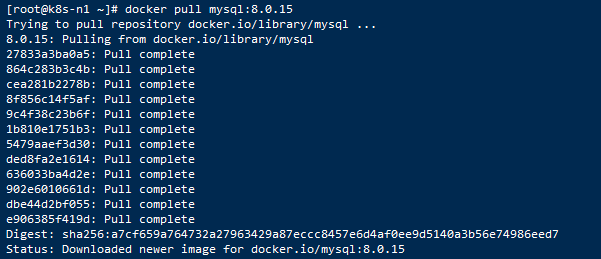
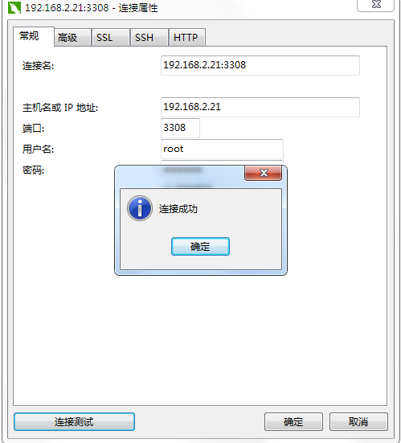
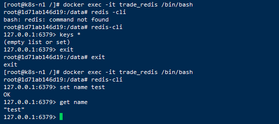
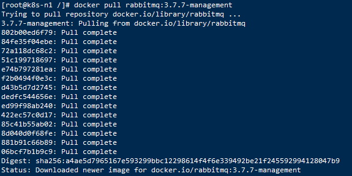
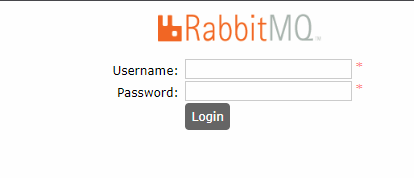

### Docker安装

#### 1、Docker 要求 
CentOS 系统的内核版本高于 3.10 ，先验证你的CentOS 版本是否支持 Docker 。
~~~
[root@k8s-n1 ~]# uname -r
3.10.0-693.el7.x86_64
~~~

#### 2、安装docker
~~~
yum update -y
yum -y install docker
~~~

#### 3、启动docker
~~~
systemctl start docker.service
~~~

#### 4、设置docker开机启动
~~~
systemctl enable docker.service
~~~

### Docker安装Mysql

#### 1、下载mysql镜像
~~~
下载最新版本：docker pull mysql
下载指定版本：docker pull mysql:8.0.15
~~~

~~~
[root@k8s-n1 ~]# docker pull mysql:8.0.15
~~~
如下图： 

#### 2、查看下载的mysql镜像
~~~
[root@k8s-n1 ~]# docker images
~~~
如下图： 

#### 3、创建目录
~~~
[root@k8s-n1 /]# mkdir -p /mnt/mysql/data /mnt/mysql/logs /mnt/mysql/conf
~~~

#### 4、启动docker里面的mysql镜像
~~~
[root@k8s-n1 /]# docker run -p 3308:3306 --name trade_mysql -v /mnt/mysql/conf:/etc/mysql/conf.d -v /mnt/mysql/logs:/logs -v /mnt/mysql/data:/var/lib/mysql -e MYSQL_ROOT_PASSWORD=123456 -d 7bb2586065cd
~~~

参数说明： 
-v 挂载宿主机目录和 docker容器中的目录 
-d 后台运行 
-p 映射容器端口号和宿主机端口号 
-e 环境参数 
7bb2586065cd 镜像id（ IMAGE ID ）

此时启动已完成，在docker启动镜像时密码加密使用的是caching_sha2_password，
在服务器端启动默认使用mysql_native_password 加密的，
如需要使用外部工具连接，需要进入docker容器重置root密码。
详细操作如下：

#### 5、进入docker容器修改Mysql
~~~
[root@k8s-n1 mysql]# docker exec -it trade_mysql /bin/sh

# mysql -u root -p

mysql> ALTER USER 'root'@'%' IDENTIFIED WITH mysql_native_password BY '123456';
~~~

#### 6、安装成功
~~~
[root@k8s-n1 /]# docker ps
~~~
查看docker容器： 

Navicat连接： 

### docker安装Redis

#### 1、使用docker查看Redis版本信息
~~~
[root@k8s-n1 /]# docker search redis
~~~

#### 2、下载redis镜像
~~~
[root@k8s-n1 /]# docker pull redis:4.0
~~~
如下图： 

#### 3、查看下载镜像的镜像id
~~~
[root@k8s-n1 /]# docker images
~~~

#### 4、启动docker里的redis镜像
~~~
[root@k8s-n1 /]# docker run -itd --name trade_redis -p 6380:6379 8280a2c45ce5
~~~

参数说明： 
-p 6380:6379：映射容器服务的 6379 端口到宿主机的 6380 端口。外部可以直接通过宿主机ip:6380 访问到 Redis 的服务。 
8280a2c45ce5 镜像id（ IMAGE ID ）

#### 5、安装成功
~~~
[root@k8s-n1 /]# docker ps
~~~
* 查看docker容器： 

* RedisDesktopManager连接： 

#### 6、测试Redis
* 进入docker容器测试
~~~
$ docker exec -it redis-test /bin/bash

root@1d71ab146d19:/data# redis-cli

127.0.0.1:6379> set name test
OK
127.0.0.1:6379> get name
"test"
127.0.0.1:6379> 
~~~
* 容器内部测试： 

### docker下安装RabbitMQ

#### 1、docker拉取RabbitMQ镜像 
~~~
[root@k8s-n1 /]# docker pull rabbitmq:3.7.7-management
~~~
如下图： 

#### 2、创建挂载目录
~~~
[root@k8s-n1 /]# mkdir /mnt/rabbitMQ/data
~~~

#### 3、查看下载镜像的镜像id
~~~
[root@k8s-n1 /]# docker images
~~~

#### 4、启动docker里的RabbitMQ镜像
~~~
[root@k8s-n1 /]# docker run -d --name rabbitmq3.7.7 -p 5672:5672 -p 15672:15672 -v /mnt/rabbitMQ/data:/var/lib/rabbitmq --hostname myRabbit -e RABBITMQ_DEFAULT_VHOST=my_vhost  -e RABBITMQ_DEFAULT_USER=admin -e RABBITMQ_DEFAULT_PASS=admin 2888deb59dfc
~~~

参数说明： 
-d 后台运行容器； 
--name 指定容器名； 
-p 指定服务运行的端口（5672：应用访问端口；15672：控制台Web端口号）； 
-v 映射目录或文件； 
--hostname  主机名（RabbitMQ的一个重要注意事项是它根据所谓的 “节点名称” 存储数据，默认为主机名）； 
-e 指定环境变量；（RABBITMQ_DEFAULT_VHOST：默认虚拟机名；RABBITMQ_DEFAULT_USER：默认的用户名；RABBITMQ_DEFAULT_PASS：默认用户名的密码）

#### 5、启动成功
~~~
[root@k8s-n1 /]# docker ps
~~~
* 查看docker容器： 

* 浏览器访问 
用浏览器访问``http://192.168.2.21:15672`` 访问成功，表示RabbitMQ安装成功。

