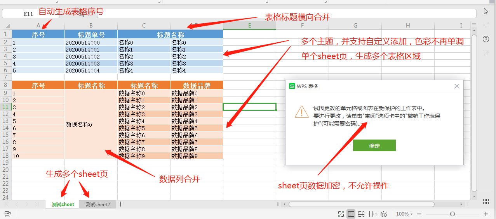
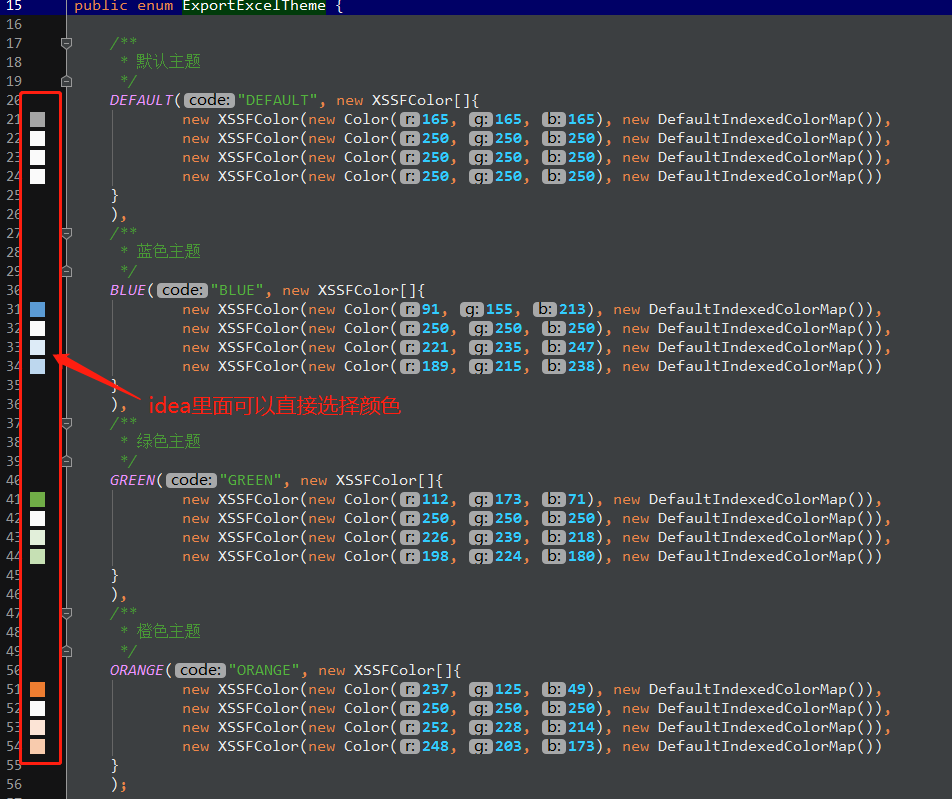
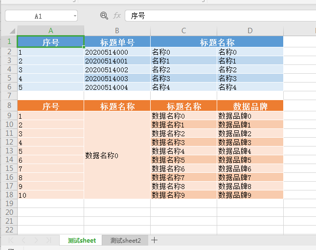

@[TOC]

> 小伙伴们工作中有没有导出excel需求呀，这里为大家献上一个风骚的导出excel的工具类。具体怎么风骚，请看下文分析。

### 项目环境：
 * SpringBoot: 2.2.6.RELEASE
 * JDK: 1.8
 * POI: 4.1.2
 * lombok: 1.16.18

### 实现功能：
 * 导出简单的excel
 * 导出多sheet的excel
 * 导出多sheet页，每个sheet页多个表格区域
 * 支持主题切换，通过配置ExportExcelBean下的theme实现，主题详情见 ExportExcelTheme
 * 支持表格的相同标题行合并，通过配置ExportExcelBean下的horizontalMergerColumnHeaders实现
 * 支持表格的相同数据列合并，通过配置ExportExcelBean下的verticalMergerColumnHeaders实现
 * 支持sheet页数据加密，通过配置ExportExcelBean下的protectSheet实现
 * 支持自动生成数据的序号

什么，你不信? 先上一波效果图吧

 
 
 怎么样，跟你说，小枫我从不吹牛皮。该关注的关注，该点赞的点赞哈！！！
 
 什么?你用不着该功能，都是一个圈子，说不准哪天就用到了，还是先收藏着吧，不占空间，又不占内存。
 
### 工具类实现

废话不多说，上代码 

#### 定义参数bean：ExportExcelBean.java
~~~java
package com.maple.common.excel;

import lombok.Data;
import java.util.List;
import java.util.Map;

/**
 * 导出excel的bean定义
 * @author ZhangFZ
 * @date 2019/12/10 10:55
 **/
@Data
public class ExportExcelBean {

    /**
     * 表格标题名
     * 使用域：table
     */
    private String title;

    /**
     * 表格属性列名List。如果需要序号，则在该数组第一个位置为'序号'，否则不生成序号
     * 使用域：table
     */
    private List<String> headers;

    /**
     * 数据Map集合中的对应的key，key在List中的位置与headers相对应。如果headers需要序号，则keys=headers.size-1
     * 使用域：table
     */
    private List<String> keys;

    /**
     * 需要显示的数据集合，集合内的数组必须为map，对应keys的值。
     * 使用域：table
     */
    private List<Map<String, Object>> dataList;

    /**
     * 水平（横向）合并的列 (仅用于标题区域，数据不会自动合并)
     * Headers不为空时，该Headers一样且连续，将会自动横向合并
     * 注意：仅用于标题，数据不会自动合并
     * 使用域：table标题区域
     */
    private List<String> horizontalMergerColumnHeaders;

    /**
     * 垂直（竖向）合并的列 (仅用于数据区域，数据不会自动合并)
     * Headers不为空时，该Headers的数据一样，将会自动竖向合并
     * 注意：重名列也会开启合并
     * 使用域：table数据区域
     */
    private List<String> verticalMergerColumnHeaders;

    /**
     * sheet页名称，如果一个excel有多个sheet页，该值不可以重复
     * 使用域：sheet页
     */
    private String sheetName;

    /**
     * 单sheet页对应多table
     * 使用域：sheet页
     */
    private List<ExportExcelBean> list;

    /**
     * 如果为空，不受保护，任意修改；
     * 如果有值，则受保护，传入的数据为密码
     * 使用域：sheet页
     */
    private String protectSheet;

    /**
     * 生成excel的主题颜色
     * 使用域：sheet页
     */
    private ExportExcelTheme theme;
}
~~~

#### 定义导出excel的表格主题：ExportExcelTheme.java
~~~java
package com.maple.common.excel;

import lombok.AllArgsConstructor;
import org.apache.poi.xssf.usermodel.DefaultIndexedColorMap;
import org.apache.poi.xssf.usermodel.XSSFColor;

import java.awt.*;

/**
 * 定义导出excel的样式主题
 * @author ZhangFZ
 * @date 2020/5/7 18:01
 **/
@AllArgsConstructor
public enum ExportExcelTheme {

    /**
     * 默认主题
     */
    DEFAULT("DEFAULT", new XSSFColor[]{
            new XSSFColor(new Color(165, 165, 165), new DefaultIndexedColorMap()),
            new XSSFColor(new Color(250, 250, 250), new DefaultIndexedColorMap()),
            new XSSFColor(new Color(250, 250, 250), new DefaultIndexedColorMap()),
            new XSSFColor(new Color(250, 250, 250), new DefaultIndexedColorMap())
    }
    ),
    /**
     * 蓝色主题
     */
    BLUE("BLUE", new XSSFColor[]{
            new XSSFColor(new Color(91, 155, 213), new DefaultIndexedColorMap()),
            new XSSFColor(new Color(250, 250, 250), new DefaultIndexedColorMap()),
            new XSSFColor(new Color(221, 235, 247), new DefaultIndexedColorMap()),
            new XSSFColor(new Color(189, 215, 238), new DefaultIndexedColorMap())
    }
    ),
    /**
     * 绿色主题
     */
    GREEN("GREEN", new XSSFColor[]{
            new XSSFColor(new Color(112, 173, 71), new DefaultIndexedColorMap()),
            new XSSFColor(new Color(250, 250, 250), new DefaultIndexedColorMap()),
            new XSSFColor(new Color(226, 239, 218), new DefaultIndexedColorMap()),
            new XSSFColor(new Color(198, 224, 180), new DefaultIndexedColorMap())
    }
    ),
    /**
     * 橙色主题
     */
    ORANGE("ORANGE", new XSSFColor[]{
            new XSSFColor(new Color(237, 125, 49), new DefaultIndexedColorMap()),
            new XSSFColor(new Color(250, 250, 250), new DefaultIndexedColorMap()),
            new XSSFColor(new Color(252, 228, 214), new DefaultIndexedColorMap()),
            new XSSFColor(new Color(248, 203, 173), new DefaultIndexedColorMap())
    }
    );

    public String code;

    /**
     * 该数组有且只能有4个值
     * theme[0]: 标题栏背景色
     * theme[1]: 标题栏字体颜色
     * theme[2]: 数据隔行色，浅
     * theme[3]: 数据隔行色，深
     */
    public XSSFColor[] theme;
}
~~~

颜色设置可以直接在idea里面选择，挺方便的

#### 【重点】导出excel的工具类：ExportExcelUtil.java
~~~java
package com.maple.common.excel;

import org.apache.commons.lang3.StringUtils;
import org.apache.poi.ss.usermodel.*;
import org.apache.poi.ss.util.CellRangeAddress;
import org.apache.poi.xssf.usermodel.*;
import javax.servlet.http.HttpServletRequest;
import javax.servlet.http.HttpServletResponse;
import java.io.IOException;
import java.io.OutputStream;
import java.io.UnsupportedEncodingException;
import java.nio.charset.StandardCharsets;
import java.util.ArrayList;
import java.util.List;
import java.util.Map;

/**
 * 导出excel的工具类，目前实现功能如下：
 * 导出简单的excel
 * 导出多sheet的excel
 * 导出多sheet页，每个sheet页多个表格区域
 * 支持主题切换，通过配置ExportExcelBean下的theme实现，主题详情见 ExportExcelTheme
 * 支持表格的相同标题行合并，通过配置ExportExcelBean下的horizontalMergerColumnHeaders实现
 * 支持表格的相同数据列合并，通过配置ExportExcelBean下的verticalMergerColumnHeaders实现
 * 支持sheet页数据加密，通过配置ExportExcelBean下的protectSheet实现
 * 支持自动生成数据的序号
 *
 * @author ZhangFZ
 * @date 2019/12/9 17:36
 **/
public class ExportExcelUtil {

    /**
     * 这是一个通用的方法，导出excel2007版，后缀为.xlsx。
     * 单Sheet页导出
     * @param out     可以将EXCEL文档导出到本地文件或者网络中
     */
    public static void exportExcel(ExportExcelBean excel, OutputStream out) {
        List<ExportExcelBean> list = new ArrayList<>();
        List<ExportExcelBean> exportExcelBeans = new ArrayList<>();
        exportExcelBeans.add(excel);
        ExportExcelBean exportExcelBean = new ExportExcelBean();
        exportExcelBean.setSheetName(excel.getSheetName());
        exportExcelBean.setList(exportExcelBeans);
        list.add(exportExcelBean);
        exportExcelMoreSheetMoreTable(list, out);
    }

    /**
     * 这是一个通用的方法，导出excel2007版，后缀为.xlsx。
     * 多Sheet页导出，多sheet页中对应多table
     * @param out     可以将EXCEL文档导出到本地文件或者网络中
     */
    public static void exportExcelMoreSheetMoreTable(List<ExportExcelBean> list, OutputStream out){
        // 声明一个工作薄
        XSSFWorkbook workbook = new XSSFWorkbook();
        for (ExportExcelBean exportExcelBeanList : list){
            creatMoreTableSheet(exportExcelBeanList, workbook);
        }
        try {
            workbook.write(out);
        } catch (IOException e) {
            e.printStackTrace();
        }
    }

    /**
     * 创建excel
     */
    private static void creatMoreTableSheet(ExportExcelBean excelBean, XSSFWorkbook workbook){
        List<ExportExcelBean> list = excelBean.getList();
        // 生成一个表格
        XSSFSheet sheet = workbook.createSheet(excelBean.getSheetName());
        // 设置表格默认列宽度为16个字节
        sheet.setDefaultColumnWidth(16);

        int listCount = 0;
        for (ExportExcelBean excel : list){
            // 设置主题样式，默认DEFAULT
            ExportExcelTheme exportExcelTheme = excel.getTheme();
            if(exportExcelTheme == null){
                exportExcelTheme = ExportExcelTheme.DEFAULT;
            }
            XSSFColor[] theme = exportExcelTheme.theme;
            XSSFCellStyle titleStyle = createTitleStyle(workbook, theme[0], theme[1]);
            XSSFCellStyle titleStyleOne = createLineStyle(workbook, theme[2]);
            XSSFCellStyle titleStyleTwo = createLineStyle(workbook, theme[3]);
            // 产生表格标题行
            createTitle(excel, sheet, titleStyle, listCount);

            // 产生表格数据
            createExcelData(excel, sheet, titleStyleOne, titleStyleTwo, listCount);

            // 与下一个表格之间空出两行
            listCount = listCount + excel.getDataList().size() + 2;
        }

        // 设置sheet页是否加密
        if(StringUtils.isNotBlank(excelBean.getProtectSheet())){
            sheet.protectSheet(excelBean.getProtectSheet());
        }
    }

    /**
     * 设置表格的标题
     */
    private static void createTitle(ExportExcelBean excel, XSSFSheet sheet, XSSFCellStyle titleStyle, int listCount){
        // 用于标志横向合并标题
        Integer horizontalNum = null;
        Object horizontalValue = null;
        XSSFRow row = sheet.createRow(listCount);
        for (int i = 0; i < excel.getHeaders().size(); i++) {
            XSSFCell cell = row.createCell(i);
            // 设置标题样式
            cell.setCellStyle(titleStyle);

            XSSFRichTextString text = new XSSFRichTextString(excel.getHeaders().get(i));
            cell.setCellValue(text);

            // 横向合并标题
            if(excel.getHorizontalMergerColumnHeaders() != null
                    && excel.getHorizontalMergerColumnHeaders().contains(excel.getHeaders().get(i))){
                if(horizontalNum == null){
                    horizontalNum = i;
                    horizontalValue = excel.getHeaders().get(i);
                }else{
                    // 当前列与前一列不相等，开启合并，并重新赋值
                    if(!horizontalValue.equals(excel.getHeaders().get(i))){
                        if(i - horizontalNum > 1){
                            CellRangeAddress cra = new CellRangeAddress(listCount, listCount, horizontalNum, i-1);
                            sheet.addMergedRegion(cra);
                        }
                        horizontalNum = i;
                        horizontalValue = excel.getHeaders().get(i);
                        // 当前为最后一列，开启合并
                    }else if(i == excel.getHeaders().size() - 1){
                        if(i - horizontalNum >= 1){
                            CellRangeAddress cra = new CellRangeAddress(listCount, listCount, horizontalNum, i);
                            sheet.addMergedRegion(cra);
                        }
                    }
                }
            }else{
                if(horizontalNum != null && i - horizontalNum > 1){
                    CellRangeAddress cra = new CellRangeAddress(listCount, listCount, horizontalNum, i-1);
                    sheet.addMergedRegion(cra);
                }else{
                    horizontalNum = null;
                    horizontalValue = null;
                }
            }
        }
    }

    /**
     * 设置表格的数据内容
     */
    private static void createExcelData(ExportExcelBean excel, XSSFSheet sheet, XSSFCellStyle titleStyleOne, XSSFCellStyle titleStyleTwo, int listCount){
        // 用于标注竖向合并数据
        Integer[] verticalNum = new Integer[excel.getKeys().size()];
        Object[] verticalValue = new Object[excel.getKeys().size()];
        //循环放置表格中的值
        for (int i = 0; i < excel.getDataList().size(); i++) {
            int line = i + listCount + 1;
            XSSFRow row = sheet.createRow(line);
            //产生序号，1,2,3,4,5...的递增序号，不需要，header去掉‘序号’就可以了
            if("序号".equals(excel.getHeaders().get(0))){
                XSSFCell cell = row.createCell(0);
                cell.setCellStyle(titleStyleOne);
                cell.setCellValue(i + 1 + "");
            }

            Map<String, Object> obj = excel.getDataList().get(i);
            for (int j = 0; j < excel.getKeys().size(); j++) {
                if (obj.get(excel.getKeys().get(j)) != null) {
                    XSSFCell cell = row.createCell(j);
                    // 设置隔行样式
                    if(i % 2 == 0){
                        cell.setCellStyle(titleStyleOne);
                    }else{
                        cell.setCellStyle(titleStyleTwo);
                    }
                    cell.setCellValue(obj.get(excel.getKeys().get(j)) + "");

                    // 纵向合并数据
                    if(excel.getVerticalMergerColumnHeaders() != null
                            && excel.getVerticalMergerColumnHeaders().contains(excel.getHeaders().get(j))){
                        if(verticalNum[j] == null){
                            verticalNum[j] = line;
                            verticalValue[j] = obj.get(excel.getKeys().get(j));
                        }else{
                            // 当前列与前一列不相等，开启合并，并重新赋值
                            if(verticalValue[j] != null && ! verticalValue[j].equals(obj.get(excel.getKeys().get(j)))){
                                if(line - verticalNum[j] > 1){
                                    CellRangeAddress cra = new CellRangeAddress(verticalNum[j], line-1, j, j);
                                    sheet.addMergedRegion(cra);
                                }
                                verticalNum[j] = line;
                                verticalValue[j] = obj.get(excel.getKeys().get(j));
                                // 当前为最后一列，开启合并
                            }else if(i == excel.getDataList().size() - 1){
                                if(line - verticalNum[j] >= 1){
                                    CellRangeAddress cra = new CellRangeAddress(verticalNum[j], line, j, j);
                                    sheet.addMergedRegion(cra);
                                }
                            }
                        }
                    }else{
                        if(verticalNum[j] != null && line - verticalNum[j] > 1){
                            CellRangeAddress cra = new CellRangeAddress(verticalNum[j], line-1, j, j);
                            sheet.addMergedRegion(cra);
                        }else{
                            verticalNum[j] = null;
                            verticalValue[j] = null;
                        }
                    }
                }
            }
        }
    }

    /**
     * 设置标题的样式
     */
    private static XSSFCellStyle createTitleStyle(XSSFWorkbook workbook, XSSFColor bgColor, XSSFColor fontColor){
        // 生成一个样式
        XSSFCellStyle style = workbook.createCellStyle();
        style.setFillPattern(FillPatternType.SOLID_FOREGROUND);
        // 水平居中
        style.setAlignment(HorizontalAlignment.CENTER);
        style.setFillForegroundColor(bgColor);
        createBorder(style);
        // 生成一个字体
        Short fontSize = 13;
        XSSFFont font = createFont(workbook, fontColor, fontSize);
        // 把字体应用到当前的样式
        style.setFont(font);
        return style;
    }

    /**
     * 设置样式
     */
    private static XSSFCellStyle createLineStyle(XSSFWorkbook workbook, XSSFColor bgColor){
        // 生成一个样式
        XSSFCellStyle style = workbook.createCellStyle();
        style.setFillPattern(FillPatternType.SOLID_FOREGROUND);
        style.setFillForegroundColor(bgColor);
        // 垂直居中
        style.setVerticalAlignment(VerticalAlignment.CENTER);
        createBorder(style);
        return style;
    }

    /**
     * 设置边框
     */
    private static void createBorder(XSSFCellStyle style){
        style.setBorderBottom(BorderStyle.THIN);
        style.setBottomBorderColor(IndexedColors.WHITE1.getIndex());
        style.setBorderLeft(BorderStyle.THIN);
        style.setLeftBorderColor(IndexedColors.WHITE1.getIndex());
        style.setBorderRight(BorderStyle.THIN);
        style.setRightBorderColor(IndexedColors.WHITE1.getIndex());
        style.setBorderTop(BorderStyle.THIN);
        style.setTopBorderColor(IndexedColors.WHITE1.getIndex());
    }

    /**
     * 生成字体样式
     * @return 字体样式
     */
    private static XSSFFont createFont(XSSFWorkbook workbook, XSSFColor color, short fontSize){
        XSSFFont font = workbook.createFont();
        font.setColor(color);
        font.setFontHeightInPoints(fontSize);
        font.setBold(true);
        return font;
    }

    /**
     * 根据浏览器处理导出文件的名字
     * @param exportFileName 文件名字
     */
    public static void updateNameUnicode(HttpServletRequest request, HttpServletResponse response, String exportFileName) throws UnsupportedEncodingException {
        response.setContentType("application/vnd.ms-excel");
        //根据浏览器类型处理文件名称
        String agent = request.getHeader("USER-AGENT").toLowerCase();
        String firefox = "firefox";
        //若是火狐
        if (agent.contains(firefox)) {
            exportFileName = new String(exportFileName.getBytes(StandardCharsets.UTF_8), "ISO8859-1");
        } else {//其他浏览器
            exportFileName = java.net.URLEncoder.encode(exportFileName, "UTF-8");
        }
        //保存导出的excel的名称
        response.setHeader("Content-Disposition", "attachment;filename=" + exportFileName + ".xlsx");
    }
}
~~~

以上代码就实现了上文中所说的导出excel的种种功能

什么，还不信? emmm~~~，那就写个测试吧

### 测试导出excel

#### 编写测试controller：ExampleController.java

~~~java
package com.maple.program.controller;

import com.alibaba.fastjson.JSONObject;
import com.maple.common.excel.ExportExcelBean;
import com.maple.common.bean.R;
import com.maple.common.excel.ExportExcelUtil;
import com.maple.program.utils.ExportExcelTitle;
import io.swagger.annotations.ApiOperation;
import lombok.extern.slf4j.Slf4j;
import org.springframework.web.bind.annotation.GetMapping;
import org.springframework.web.bind.annotation.RestController;

import javax.servlet.http.HttpServletRequest;
import javax.servlet.http.HttpServletResponse;
import java.io.IOException;
import java.io.OutputStream;
import java.util.ArrayList;
import java.util.HashMap;
import java.util.List;
import java.util.Map;

/**
 * @author ZhangFZ
 * @date 2020/5/7 13:52
 **/
@RestController
@Slf4j
public class ExampleController {

    @GetMapping("/exportSimpleExcel")
    @ApiOperation(value = "导出简单的excel")
    public R exportSimpleExcel(HttpServletRequest request, HttpServletResponse response){

        List<Map<String, Object>> list = new ArrayList<>();
        int num = 10;
        for (int i = 0; i < num; i++) {
            Map<String, Object> map = new HashMap<>(16);
            map.put("code", "数据名称" + i);
            map.put("name", "数据编码" + i);
            map.put("brand", "数据品牌" + i);
            list.add(map);
        }

        try {
            String exportFileName = "简单的excel ";
            ExportExcelUtil.updateNameUnicode(request, response, exportFileName);
            OutputStream out = response.getOutputStream();
            //保存导出的excel的名称
            ExportExcelBean table = ExportExcelTitle.table2.getValue();
            table.setDataList(list);
            log.info("导出的数据JSON格式：{}", JSONObject.toJSONString(table));
            ExportExcelUtil.exportExcel(table, out);

            out.flush();
            out.close();
        } catch (IOException e) {
            e.printStackTrace();
        }
        return null;
    }

    @GetMapping("/exportExcelMoreSheetMoreTable")
    @ApiOperation(value = "导出多sheet，单sheet拥有多表格的excel")
    public R exportExcelMoreSheetMoreTable(HttpServletRequest request, HttpServletResponse response){

        List<ExportExcelBean> excelBean = new ArrayList<>();

        // 模拟数据
        List<Map<String, Object>> list = new ArrayList<>();
        for (int i = 0; i < 5; i++) {
            Map<String, Object> map = new HashMap<>(16);
            map.put("name", "名称" + i);
            map.put("name1", "名称" + i);
            map.put("code", "2020051400" + i);
            list.add(map);
        }
        List<Map<String, Object>> list2 = new ArrayList<>();
        for (int i = 0; i < 10; i++) {
            Map<String, Object> map = new HashMap<>(16);
            map.put("name", "数据名称" + i);
            map.put("code", "数据名称" + 0);
            map.put("brand", "数据品牌" + i);
            list2.add(map);
        }
        try {
            String exportFileName = "测试数据";
            ExportExcelUtil.updateNameUnicode(request, response, exportFileName);
            OutputStream out = response.getOutputStream();

            // 表格1
            ExportExcelBean table1 = ExportExcelTitle.table1.getValue();
            table1.setDataList(list);

            // 表格2
            ExportExcelBean table2 = ExportExcelTitle.table2.getValue();
            table2.setDataList(list2);

            // sheet1
            ExportExcelBean sheet1 = new ExportExcelBean();

            // sheet1 - 多表格
            List<ExportExcelBean> tables1 = new ArrayList<>();
            tables1.add(table1);
            tables1.add(table2);

            sheet1.setSheetName("测试sheet");
            sheet1.setList(tables1);
            // 设置sheet的密码，仅作用于当前sheet页
            sheet1.setProtectSheet("123456");
            excelBean.add(sheet1);

            // sheet2
            ExportExcelBean sheet2 = new ExportExcelBean();

            // sheet2 - 多表格
            List<ExportExcelBean> tables2 = new ArrayList<>();
            tables2.add(table2);
            tables2.add(table1);

            sheet2.setSheetName("测试sheet2");
            sheet2.setList(tables2);
            excelBean.add(sheet2);

            log.info("导出的数据JSON格式：{}", JSONObject.toJSONString(excelBean));
            ExportExcelUtil.exportExcelMoreSheetMoreTable(excelBean, out);
            out.flush();
            out.close();
        } catch (IOException e) {
            e.printStackTrace();
        }
        return null;
    }
}
~~~

#### 定义两个表格吧：ExportExcelTitle.java

为了表示我的童叟无欺，就定义一个和上图一样的吧。（其实我真的懒~~~）

~~~java
package com.maple.program.utils;

import com.maple.common.excel.ExportExcelBean;
import com.maple.common.excel.ExportExcelTheme;
import lombok.AllArgsConstructor;
import lombok.Getter;

import java.util.ArrayList;
import java.util.List;

/**
 * @author ZhangFZ
 * @date 2020/5/8 15:24
 **/
public class ExportExcelTitle {

    @Getter
    @AllArgsConstructor
    public enum table1 {

        INDEX("序号", "index"),
        CODE("标题单号", "code"),
        NAME("标题名称",  "name"),
        NAME1("标题名称",  "name1");

        /**
         * 中文标题
         */
        private String titleCn;

        /**
         * 查出的值对应Map的key
         */
        private String valueKey;

        /**
         * 获取excel对应的数据
         */
        public static ExportExcelBean getValue() {
            List<String> titleCn = new ArrayList<>();
            List<String> valueKey = new ArrayList<>();
            for (table1 excel : table1.values()) {
                titleCn.add(excel.titleCn);
                valueKey.add(excel.valueKey);
            }
            ExportExcelBean excelBean = new ExportExcelBean();
            excelBean.setHeaders(titleCn);
            excelBean.setTitle("测试导出信息1");
            excelBean.setSheetName("测试sheet");
            excelBean.setKeys(valueKey);
            excelBean.setTheme(ExportExcelTheme.BLUE);
            excelBean.setVerticalMergerColumnHeaders(titleCn);
            excelBean.setHorizontalMergerColumnHeaders(titleCn);
            return excelBean;
        }
    }

    @Getter
    @AllArgsConstructor
    public enum table2 {

        INDEX("序号", "index"),
        CODE("标题名称", "code"),
        NAME("标题名称",  "name"),
        BRAND("数据品牌", "brand");

        /**
         * 中文标题
         */
        private String titleCn;

        /**
         * 查出的值对应Map的key
         */
        private String valueKey;

        /**
         * 获取excel对应的数据
         */
        public static ExportExcelBean getValue() {
            List<String> titleCn = new ArrayList<>();
            List<String> valueKey = new ArrayList<>();
            for (table2 excel : table2.values()) {
                titleCn.add(excel.titleCn);
                valueKey.add(excel.valueKey);
            }
            ExportExcelBean excelBean = new ExportExcelBean();
            excelBean.setHeaders(titleCn);
            excelBean.setTitle("测试导出信息2");
            excelBean.setSheetName("测试sheet2");
            excelBean.setKeys(valueKey);
            excelBean.setTheme(ExportExcelTheme.ORANGE);
            excelBean.setVerticalMergerColumnHeaders(titleCn);
            // excelBean.setHorizontalMergerColumnHeaders(titleCn);
            return excelBean;
        }
    }
}
~~~

好喽，到此就结束了呀。代码可以直接拿去用了~~~

看一下测试结果再走吧

### 测试结果

输入地址：http://127.0.0.1:8888/exportExcelMoreSheetMoreTable

下载成功后，引入眼睑的是以下这图：

不是说可以生成多sheet页吗？单sheet页多table我们见识过了，那就让我们来看一看sheet2

最后，再多来几种主题吧。主题通过配置ExportExcelBean下的theme实现。什么，没有你喜欢的颜色？青青草原淡绿色都配上了，居然还没有你喜欢的。算了算了，你自己在 ExportExcelTheme 下面添加自己喜欢的色彩吧

好了，到这里真的该结束了，如果你还需要其他功能，可以基于现有功能添加，当然也可以贡献给我们，让大家一起白嫖。有什么问题，可以留言或者联系我哟~~~

> 本文到此结束了，后续文章会陆续更新，文档会同步在CSDN和GitHub保持同步更新。 
> 源码已上传至github：https://github.com/hack-feng/maple-common.git/  
> 点个关注再走呗~~~
