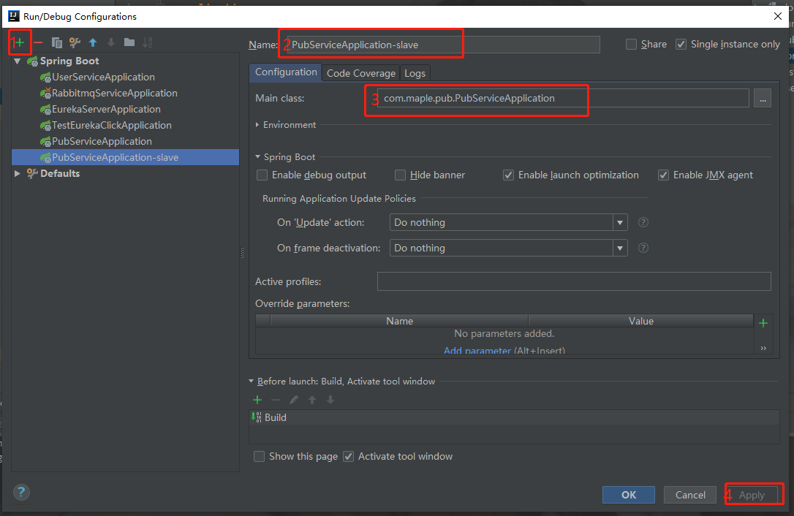

> 上一回说到Feign，Fegin的底层使用了Http请求，Ribbon做负载均衡。那么本篇就验证下Fegin是否使用了负载均衡。然后讲解使用RestTemplate的请求服务的时候，如何使用Ribbon负载均衡。

本文基于[探秘SpringCloud系列《第三篇章：使用Fegin声明式服务调用》](https://blog.csdn.net/qq_34988304/article/details/103984893)一文继续延伸。

### 测试Fegin调用使用了负载均衡

1. 在user-service模拟循环调用pub-service的服务。

添加MoreUserGoPubController.java
~~~java
package com.maple.user.controller;

import com.maple.user.fegin.PubServiceFegin;
import org.springframework.beans.factory.annotation.Autowired;
import org.springframework.web.bind.annotation.GetMapping;
import org.springframework.web.bind.annotation.RequestMapping;
import org.springframework.web.bind.annotation.RestController;

/**
 * 模拟大量用户去酒馆消费
 * @author ZhangFZ
 * @date 2020-1-15 19:39
 */
@RestController
@RequestMapping("/moreUserGoPubController")
public class MoreUserGoPubController {

    private final PubServiceFegin pubServiceFegin;

    @Autowired
    public MoreUserGoPubController(PubServiceFegin pubServiceFegin) {
        this.pubServiceFegin = pubServiceFegin;
    }

    @GetMapping("/moreUserGoPub")
    public void moreUserGoPub(){
        for (int i = 0; i < 10; i++) {
            String speak = "小二，来两坛上等的" + i + "锅头，两斤牛肉，一只烤羊腿";
            System.out.println("【发送消息】：" + speak);
            String result = pubServiceFegin.serviceUser(speak);
            System.out.println("【收到小二回话】：" + result);
        }
    }
}
~~~

2. 将pub-service启动两个服务，修改application.yml的server.port分别为8001和8002

> 如何在同一个idea里面同一个服务同时启动多次

启动eureka-server、user-service、pub-service

修改pub-service的application.yml中的server.port分别为8002，PubServiceApplication-slave

浏览器Get请求：http://127.0.0.1:8000/moreUserGoPubController/moreUserGoPub

