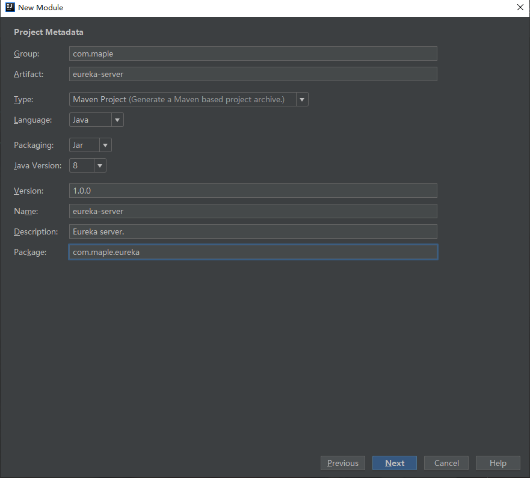
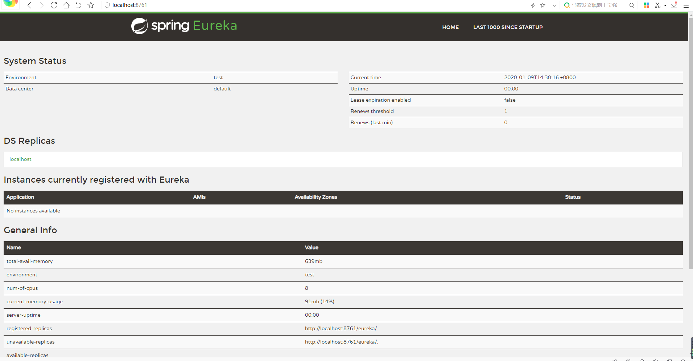

> 上一篇说到Eureka注册中心的一下概念，你在实际中我们该怎么去搭建Eureka Server，又该怎么使用呢？今天我们来细细探讨。

首先，基于我们Maven搭建的SpringCloud的项目，继续创建一个父级Module。创建完成后删除src目录。
> * groupId: com.maple
> * artifactId: cloud-eureka
> * version: 1.0.0

### 创建Eureka Server服务
然后在cloud-eureka项目上右击，New->Module，选择Spring Initializr，点击Next。

> * groupId: com.maple
> * artifactId: eureka-server
> * version: 1.0.0

注意以下目录

1. 创建完成之后，修改pom.xml文件
~~~xml
<?xml version="1.0" encoding="UTF-8"?>
<project xmlns="http://maven.apache.org/POM/4.0.0" xmlns:xsi="http://www.w3.org/2001/XMLSchema-instance"
         xsi:schemaLocation="http://maven.apache.org/POM/4.0.0 https://maven.apache.org/xsd/maven-4.0.0.xsd">
    <modelVersion>4.0.0</modelVersion>
    <parent>
        <artifactId>Spring-Cloud-Edgware</artifactId>
        <groupId>com.maple</groupId>
        <version>1.0.0</version>
    </parent>
    <artifactId>eureka-server</artifactId>
    <version>1.0.0</version>
    <name>eureka-server</name>
    <description>Eureka server.</description>
    <packaging>jar</packaging>

    <dependencies>
        <!-- 引入Eureka Server，用于注册Eureka服务 -->
        <dependency>
            <groupId>org.springframework.cloud</groupId>
            <artifactId>spring-cloud-starter-eureka-server</artifactId>
        </dependency>
    </dependencies>

    <build>
        <plugins>
            <plugin>
                <groupId>org.springframework.boot</groupId>
                <artifactId>spring-boot-maven-plugin</artifactId>
            </plugin>
        </plugins>
    </build>

</project>
~~~

2. 将application.properties修改为application.yml。并添加以下内容：
~~~yml
server:
  # 服务注册中心端口号
  port: 8761

spring:
  application:
    # 项目名
    name: eureka-server

eureka:
  instance:
    # 注册中心主机名
    hostname: localhost
    prefer-ip-address: true
  client:
    # false表示不向注册中心注册自己。
    registerWithEureka: false
    # false表示自己端就是注册中心，我的职责就是维护服务实例，并不需要去检索服务
    fetchRegistry: false
    serviceUrl:
      # 单机设置与Eureka Server交互的地址查询服务和注册服务都需要依赖这个地址（单机
      defaultZone: http://${eureka.instance.hostname}:${server.port}/eureka/
~~~

3. 修改EurekaServerApplication.java主入口文件，添加`@EnableEurekaServer`注解
~~~
@EnableEurekaServer
@SpringBootApplication
public class EurekaServerApplication {

    public static void main(String[] args) {
        SpringApplication.run(EurekaServerApplication.class, args);
    }
}
~~~

这样Eureka Server就搭建完成了，启动一下项目，访问http://127.0.0.1:8761/，让我们一起感受一下。

### 创建Eureka Click服务

1. 接下来，我们创建一个Eureka Click，然后让他注册到Eureka Server上。

> 在cloud-eureka项目上右击，New->Module，选择Spring Initializr，点击Next。

> * groupId: com.maple
> * artifactId: test-eureka-click
> * version: 1.0.0

2. 修改pom.xml文件
~~~xml
<?xml version="1.0" encoding="UTF-8"?>
<project xmlns="http://maven.apache.org/POM/4.0.0" xmlns:xsi="http://www.w3.org/2001/XMLSchema-instance"
         xsi:schemaLocation="http://maven.apache.org/POM/4.0.0 https://maven.apache.org/xsd/maven-4.0.0.xsd">
    <modelVersion>4.0.0</modelVersion>
    <parent>
        <artifactId>Spring-Cloud-Edgware</artifactId>
        <groupId>com.maple</groupId>
        <version>1.0.0</version>
    </parent>
    <artifactId>test-eureka-click</artifactId>
    <version>0.0.1-SNAPSHOT</version>
    <name>test-eureka-click</name>
    <description>Eureka click test service.</description>

    <dependencies>
        <!-- 添加Eureka Click的依赖 -->
        <dependency>
            <groupId>org.springframework.cloud</groupId>
            <artifactId>spring-cloud-starter-eureka</artifactId>
        </dependency>
    </dependencies>

    <build>
        <plugins>
            <plugin>
                <groupId>org.springframework.boot</groupId>
                <artifactId>spring-boot-maven-plugin</artifactId>
            </plugin>
        </plugins>
    </build>
</project>
~~~

3. 将application.properties修改为application.yml。并添加以下内容：
~~~yml
server:
  port: 8762
spring:
  application:
    name: test-eureka-client

#注册服务到eureka-server
eureka:
  client:
    service-url:
      defaultZone: http://127.0.0.1:8761/eureka/
~~~

4. 修改TestEurekaClickApplication.java，添加`@EnableDiscoveryClient`注解
~~~java
@EnableDiscoveryClient
@SpringBootApplication
public class TestEurekaClickApplication {

    public static void main(String[] args) {
        SpringApplication.run(TestEurekaClickApplication.class, args);
    }
}
~~~

这样Eureka Click就搭建完成了，启动一下项目，访问http://127.0.0.1:8761/，让我们一起感受一下。
> 记得Eureka Server不要关闭呦， Eureka Click是需要向Eureka Server注册的。

