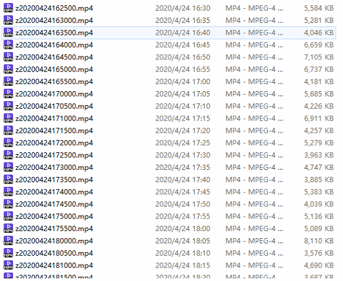

### 项目背景
项目中用到了海康威视的摄像机视频服务器。项目要求，要将海康威视的摄像视频同步按时间至我们自己的服务器，并且在项目中记录文件信息。

### 项目环境
* SpringBoot + JDK1.8
* 海康威视设备型号：DS-7608N-K2/8P

### 引入SDK
首先在海康卫视下载对应的SDK包。

官网下载地址：[https://www.hikvision.com/cn/download_61.html](https://www.hikvision.com/cn/download_61.html)

解压下载的SDK文件，如下图：
 
 
 * Demo示例：其中有java的一个demo，大家也可以参考一下
 * 开发文档：包含了海康威视不同设备的SDK对接文档
 * 库文件：需要部分dll文件引用，通过dll文件去调用海康威视的服务器，需要的文件下文详细介绍
 
 打开我们的SpringBoot项目

- 首先将demo示例中java例子的HCNetSDK.java文件拷贝至我们项目，项目位置没有特殊要求。
- 然后将库文件中的HCNetSDKCom文件夹及下面的所有文件、AudioRender.dll、HCCore.dll、HCNetSDK.dll、PlayCtrl.dll、SuperRender.dll文件放置指定的文件夹
 
- 修改HCNetSDK.java文件的HCNetSDK加载dll文件的位置。如下：D:\\HKSDK\\HCNetSDK为dll文件存放的目录。

~~~
 HCNetSDK INSTANCE = (HCNetSDK) Native.loadLibrary("D:\\HKSDK\\HCNetSDK", HCNetSDK.class);
~~~

- pom文件引入SDK二次开发所需要的jar包。jar包均手动引入，不是通过maven网上下载。官方示例中的javaDemo中有相应的jar包。
~~~
<dependency>
    <groupId>net.java.jna</groupId>
    <artifactId>jna</artifactId>
    <version>1.0.0</version>
</dependency>
<dependency>
    <groupId>net.java.jna</groupId>
    <artifactId>examples</artifactId>
    <version>1.0.0</version>
</dependency>
~~~

### 编写程序代码

~~~java
import com.sun.jna.NativeLong;
import com.sun.jna.ptr.IntByReference;
import com.urgentlogistic.util.HCNetSDK;
import org.slf4j.Logger;
import org.slf4j.LoggerFactory;
import org.springframework.scheduling.annotation.Scheduled;

import java.text.ParseException;
import java.text.SimpleDateFormat;
import java.util.Date;
import java.util.Timer;

/**
 * @author ZhangFZ
 * @date 2020/4/20 20:23
 **/
public class VideoDowload {

    private static Logger logger = LoggerFactory.getLogger(VideoDowload.class);
    private static HCNetSDK hcNetSDK = HCNetSDK.INSTANCE;
    private NativeLong userId;//用户句柄
    private NativeLong loadHandle;//下载句柄
    private Timer downloadTimer;

    /**
     * 按时间下载视频
     */
    private boolean downloadVideo(Dvr dvr, Date startTime, Date endTime, String filePath, int channel) {
        boolean initFlag = hcNetSDK.NET_DVR_Init();
        if (!initFlag) { //返回值为布尔值 fasle初始化失败
            logger.warn("hksdk(视频)-海康sdk初始化失败!");
            return false;
        }
        HCNetSDK.NET_DVR_DEVICEINFO_V30 deviceInfo = new HCNetSDK.NET_DVR_DEVICEINFO_V30();
        userId = hcNetSDK.NET_DVR_Login_V30(dvr.getDvrip(), (short) dvr.getDvrport(), dvr.getDvrusername(), dvr.getDvrpassword(), deviceInfo);
        logger.info("hksdk(视频)-登录海康录像机信息,状态值:" + hcNetSDK.NET_DVR_GetLastError());
        long lUserId = userId.longValue();
        if (lUserId == -1) {
            logger.warn("hksdk(视频)-海康sdk登录失败!");
            return false;
        }
        loadHandle = new NativeLong(-1);
        if (loadHandle.intValue() == -1) {
            loadHandle = hcNetSDK.NET_DVR_GetFileByTime(userId, new NativeLong(channel), getHkTime(startTime), getHkTime(endTime), filePath);
            logger.info("hksdk(视频)-获取播放句柄信息,状态值:" + hcNetSDK.NET_DVR_GetLastError());
            if (loadHandle.intValue() >= 0) {
                // 判断文件夹是否存在
                File files = new File(filePath);
                if(!files.exists()){
                    files.mkdirs();
                }
                boolean downloadFlag = hcNetSDK.NET_DVR_PlayBackControl(loadHandle, hcNetSDK.NET_DVR_PLAYSTART, 0, null);
                int tmp = -1;
                IntByReference pos = new IntByReference();
                while (true) {
                    boolean backFlag = hcNetSDK.NET_DVR_PlayBackControl(loadHandle, hcNetSDK.NET_DVR_PLAYGETPOS, 0, pos);
                    if (!backFlag) {//防止单个线程死循环
                        return downloadFlag;
                    }
                    int produce = pos.getValue();
                    if ((produce % 10) == 0 && tmp != produce) {//输出进度
                        tmp = produce;
                        logger.info("hksdk(视频)-视频下载进度:" + "==" + produce + "%");
                    }
                    if (produce == 100) {//下载成功
                        hcNetSDK.NET_DVR_StopGetFile(loadHandle);
                        loadHandle.setValue(-1);
                        hcNetSDK.NET_DVR_Logout(userId);//退出录像机
                        logger.info("hksdk(视频)-退出状态" + hcNetSDK.NET_DVR_GetLastError());
                        //hcNetSDK.NET_DVR_Cleanup();
                        return true;
                    }
                    if (produce > 100) {//下载失败
                        hcNetSDK.NET_DVR_StopGetFile(loadHandle);
                        loadHandle.setValue(-1);
                        logger.warn("hksdk(视频)-海康sdk由于网络原因或DVR忙,下载异常终止!错误原因:" + hcNetSDK.NET_DVR_GetLastError());
                        //hcNetSDK.NET_DVR_Logout(userId);//退出录像机
                        //logger.info("hksdk(视频)-退出状态"+hcNetSDK.NET_DVR_GetLastError());
                        return false;
                    }
                }
            } else {
                System.out.println("hksdk(视频)-下载失败" + hcNetSDK.NET_DVR_GetLastError());
                return false;
            }
        }
        return false;
    }

    /**
     * 获取海康录像机格式的时间
     */
    private HCNetSDK.NET_DVR_TIME getHkTime(Date time) {
        HCNetSDK.NET_DVR_TIME structTime = new HCNetSDK.NET_DVR_TIME();
        String str = new SimpleDateFormat("yyyy-MM-dd-HH-mm-ss").format(time);
        String[] times = str.split("-");
        structTime.dwYear = Integer.parseInt(times[0]);
        structTime.dwMonth = Integer.parseInt(times[1]);
        structTime.dwDay = Integer.parseInt(times[2]);
        structTime.dwHour = Integer.parseInt(times[3]);
        structTime.dwMinute = Integer.parseInt(times[4]);
        structTime.dwSecond = Integer.parseInt(times[5]);
        return structTime;
    }

    public static void main(String[] args) {
        SimpleDateFormat sdf = new SimpleDateFormat("yyyyMMddHHmmss");
        Date startTime = null;
        Date endTime = null;
        try {
            startTime = sdf.parse("20200422170000");   //开始时间
            endTime = sdf.parse("20200422180000");      //结束时间
        } catch (ParseException e) {
            e.printStackTrace();
        }
        VideoDowload test = new VideoDowload();
        Dvr dvr = new Dvr("http://192.168.0.167",80,"admin","123456");
        int channel = 33;//通道
        System.out.print(test.downloadVideo(dvr, startTime, endTime, "D:\\testhk\\test.mp4", channel));
    }
}
~~~

Dvr类：
~~~java
import lombok.Data;

/**
 * @author ZhangFZ
 * @date 2020/4/21 9:32
 **/
@Data
public class Dvr {

    // 视频服务器ip地址
    private String dvrip;
    // 视频服务器端口号
    private int dvrport;
    // 视频服务器用户名
    private String dvrusername;
    // 视频服务器密码
    private String dvrpassword;

    public Dvr(String dvrip, int dvrport, String dvrusername, String dvrpassword) {
        this.dvrip = dvrip;
        this.dvrport = dvrport;
        this.dvrusername = dvrusername;
        this.dvrpassword = dvrpassword;
    }
}
~~~

注意事项：
* 自己的服务器信息请手动修改，保存目录等信息请手动修改
* channel通道号是32起，比如你的通道为1，这里需要写33，原因咨询海康威视的技术。
* 这里只是一个简单的demo，具体操作根据自己业务的实际情况来。

下图是定时5分钟取一次数据的结果
 

### 视频无法播放的问题
> 因为你的音频不是mpeg4容器支持的音频格式。通过mediainfo分析可知，你的音频格式是pcm_alaw，并且还有一行警告信息:
  FileExtension_Invalid : mpeg mpg m2p vob vro pss evo
  你的视频格式应该是MPEG-PS格式，但是后缀却是mp4，其实是一个非法的MP4。mediainfo还会告诉你合法的后缀应该是上述那几个。由于你的音频格式根本不被浏览器支持，但是视频格式是被浏览器支持的(H.264/AVC)。那么解决方案其实也简单，抽调音频即可。参考ffmpeg命令行(不转码，直接复制流):
  ffmpeg -i demo.mp4 -c copy -an demp_enc.mp4
  速度很快，使用-an参数屏蔽掉音频流，将封装格式转为mp4。再次用mediainfo查看，格式已经显示MPEG-4，是一个标准的mp4容器封装了，在当今主流的浏览器都能直接播放。
  
 下载ffmpeg解码工具[官网](http://www.ffmpeg.org/download.html)下载ffmpeg，解压安装找到ffmpeg.exe。
 
 
添加一下工具类
~~~
// ffmpeg.exe存放的位置
private static String ffmpegEXE = "D:\\software\\ffmpg\\bin\\ffmpeg.exe";

//ffmpeg -i demo.mp4 -c copy -an demp_enc.mp4
public static void convetor(String videoInputPath, String videoOutPath) throws Exception {
    List<String> command = new ArrayList<String>();
    command.add(ffmpegEXE);
    command.add("-i");
    command.add(videoInputPath);
    command.add("-c");
    command.add("copy");
    command.add("-an");
    command.add(videoOutPath);
    ProcessBuilder builder = new ProcessBuilder(command);
    Process process = null;
    try {
        process = builder.start();
    } catch (IOException e) {
        // TODO Auto-generated catch block
        e.printStackTrace();
    }
    // 使用这种方式会在瞬间大量消耗CPU和内存等系统资源，所以这里我们需要对流进行处理
    InputStream errorStream = process.getErrorStream();
    InputStreamReader inputStreamReader = new InputStreamReader(errorStream);
    BufferedReader br = new BufferedReader(inputStreamReader);
    String line = "";
    while ((line = br.readLine()) != null) {
    }
    if (br != null) {
        br.close();
    }
    if (inputStreamReader != null) {
        inputStreamReader.close();
    }
    if (errorStream != null) {
        errorStream.close();
    }

}
~~~

下载视频成功后，调用该方法进行转码，修改VideoDowload.java代码为以下：
~~~
if (produce == 100) {//下载成功
    hcNetSDK.NET_DVR_StopGetFile(loadHandle);
    loadHandle.setValue(-1);
    hcNetSDK.NET_DVR_Logout(userId);//退出录像机
    logger.info("hksdk(视频)-退出状态" + hcNetSDK.NET_DVR_GetLastError());
    hcNetSDK.NET_DVR_Cleanup();

    Media media = new Media();
    media.setDisasterId(disasterId);
    media.setType(MediaType.VIDEO);
    media.setCreateDate(new Date());
    media.setUploadTime(new Date());
    media.setAttachmentName("z" + fileName);
    media.setIsDeleted(false);
    media.setUpdate_rhtx(1);
    media.setFlag("OTHER");
    media.setNewsFeedId(0);
    String http_path = restUrlLocalhost;
    media.setUrl(http_path + "/urgentlogistic/file/mp4/" + newDate + "/z" +fileName);
    mediaService.create(media);

    try {
        // 视频进行转码
        convetor(filePath + fileName,filePath + "z" +fileName);
        File file = new File(filePath + fileName);
        // 如果文件路径所对应的文件存在，并且是一个文件，则直接删除
        file.delete();
    } catch (Exception e) {
        e.printStackTrace();
    }

    return true;
}
~~~

运行完就会多一个视频文件，然后就可以用通用播放器播放这个新的视频了，至于老的视频任凭自己需求处理掉就行啦

最后在附上官方开发人员的邮箱 sdk@hikvision.com

如果对您有帮助，请点个赞，关注下小编再走哟，有什么问题可以在评论区留言，经常在线，看到一定回复。

> 本章到此结束。后续文章会陆续更新，文档会同步在CSDN和GitHub保持同步更新。 
> CSDN：https://blog.csdn.net/qq_34988304/category_8820134.html  
> Github文档：https://github.com/hack-feng/Java-Notes/tree/master/src/note/SpringCloud  